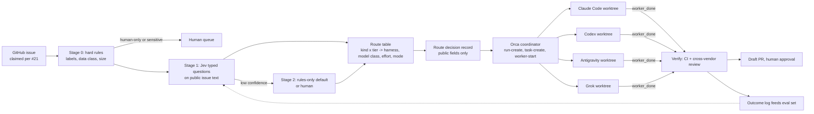

# Orca as a multi-harness dispatcher, with Jev-classified model and effort routing

Status: proposal, planning only. Nothing in this document is built, installed, enabled or paid for. Tracking issue: #51, under epic #1.

This page explores one candidate for the "Coop orchestration" capability in [docs/architecture.md](../architecture.md): running Claude Code, Codex, Antigravity (Gemini) and Grok in parallel under [Orca](https://github.com/stablyai/orca), with a classifier that picks the harness, model and effort level for each task. Per [ADR 003](../adr/003-evaluations-and-bounded-autonomy.md), every route below is a hypothesis to measure, not a role assigned by vendor reputation.

Facts are cited to the source checked on 2026-10-09. Statements marked *inference* are this document's reasoning, not something a source says.

## 1. What "Orca" and "Jev" are

### Orca

Several projects share the name. The maintainer confirmed on 2026-10-10 that the intended one is **stablyai/orca**, which is also the only candidate that names all four harnesses.

| Candidate | What it is | Fit | Confidence |
| --- | --- | --- | --- |
| [stablyai/orca](https://github.com/stablyai/orca) ("Orca ADE", [onorca.dev](https://www.onorca.dev)) | MIT-licensed desktop app plus CLI for running many CLI coding agents in parallel, each in its own git worktree. Supported agents include Claude Code, Codex, Grok, Antigravity and "any CLI agent". | Direct fit | Confirmed by the maintainer |
| [orca-cli/orca](https://github.com/orca-cli/orca) | Go binary with SQLite run state, worktree isolation, a task DAG ("pods") and an MCP server. Names Claude Code, Codex, Gemini CLI and others. | Same idea, but the repository showed 0 stars and 5 commits, and says interfaces may change before v1.0 | Low as a dependency; noted as an alternative |
| Others named Orca (other small GitHub repos, Microsoft's Orca research models, Orca Security, Orca AI maritime) | Unrelated or unverified | None | Not researched beyond the name |

Verified Orca capabilities that matter here (sources: [README](https://github.com/stablyai/orca), [CLI overview](https://www.onorca.dev/docs/cli/overview), [CLI reference](https://www.onorca.dev/docs/cli/reference), [orchestration](https://www.onorca.dev/docs/cli/orchestration), [ways to run](https://www.onorca.dev/docs/ways-to-run), [hooks](https://www.onorca.dev/docs/agents/hooks-memory), [automations](https://www.onorca.dev/docs/cli/automations), [telemetry](https://www.onorca.dev/docs/telemetry)):

| Capability | What the docs say | Relevance |
| --- | --- | --- |
| Worktree per agent | Each task runs in an isolated git worktree. One prompt can fan out to several agents so you can compare results and merge the winner. | Parallel work without branch collisions |
| Bring your own subscription | Agents run with the user's own CLI logins. An account switcher tracks Claude and Codex usage and rate-limit resets. | Fits the four existing subscriptions |
| Orchestration (experimental) | `run-create`, `task-create`, `worker-start --agent <name>`, `check --wait`. Tasks have statuses (`pending`, `ready`, `dispatched`, `completed`, `failed`, `blocked`). Workers report `worker_done` with `--outcome succeeded\|failed`, plus `heartbeat`, `ask`, and decision gates. | This is the dispatcher the router drives |
| Model and effort per launch | `worker-start` accepts `--model` (opaque provider model ID) and `--effort` (needs `--model`, refused when unsupported). The receipt shows `launch.requested` and `launch.effective`. Documented for Claude, Codex, Muse, Cursor, Antigravity and OpenCode. | The routing decision has a direct place to land |
| Grok | Listed as a supported agent. Grok is **not** in the list of agents that accept `--model`/`--effort`. | Grok runs on its CLI defaults unless that changes |
| Scheduling | `orca automations create --trigger <preset\|cron\|RRULE> --prompt ... --provider codex\|claude`. No model flag is documented for automations. | Possible later trigger path |
| Headless and remote | `orca serve --pairing-address <tailscale address>` runs a server that owns worktrees and agent processes; clients only show UI. SSH hosts and per-workspace cloud VMs are also supported. | Lets the dispatcher live on a machine you choose |
| JSON everywhere | Most commands take `--json`. | A plain script can act as coordinator (*inference*) |
| Telemetry | Anonymous usage events to PostHog Cloud. Prompts, responses, terminal contents, paths and repo names are excluded. Opt out with `DO_NOT_TRACK=1` or `ORCA_TELEMETRY_DISABLED=1`. | Opt out anyway; see section 6 |

What Orca does **not** do, per the same docs: it has no automatic agent or model selection, no documented concurrency or retry limits, no documented timeout for a worker that never reports, and the orchestration feature is labelled experimental. So **Orca is the dispatcher and supervisor, not the router.** The routing decision has to come from somewhere else, which is where Jev fits.

### Jev

The request says "jev based classifier". The maintainer confirmed on 2026-10-10 that this means **Jev by TypeSafe**, a hosted "System One" model that answers typed questions with probabilities instead of generating text.

Verified facts (sources: [LiteLLM benchmark](https://docs.litellm.ai/blog/jev-auto-router-benchmark), [Glean](https://www.glean.com/blog/jev-zero-shot-classifier), [Arize](https://arize.com/blog/typesafe-jev-llm-judge/), [Promptfoo provider docs](https://www.promptfoo.dev/docs/providers/typesafe/)):

- You send a `state` (text or JSON) and typed questions: `Choice` (one of up to 255 options, with a probability each), `Score` (ordered levels, up to 10) and `Noul` (yes/no). All questions in one request are answered against the same state, up to 64k tokens.
- It returns answers and probabilities only. There is no rationale text, so errors have to be analysed from inputs and labels.
- It is a hosted API at `api.typesafe.ai` with an API key. No self-hosted version is documented. Third-party "open reproductions" exist, per Glean, but were not evaluated here.
- Pin a version (`jev-1.13.0`); `jev-latest` moves on each release.
- Listed price is $0.042 per million input tokens, output free. Promptfoo states Jev is not trained on customer requests; zero data retention is offered to enterprise customers only, and other accounts have no fixed retention period stated.
- LiteLLM ships a Jev-based "complexity router" with tiers SIMPLE, MEDIUM, COMPLEX and REASONING. In LiteLLM's own benchmark (80 authored cases, 3 repeats, labels not independently reviewed), Jev matched the expected tier in 95% of calls versus 73.75% for a Haiku classifier, at about 127 ms p50. LiteLLM notes this does not measure answer quality, and long prompts matched less often (87.5%).
- Arize and Glean both call the published results early and small, and recommend validating calibration on your own data before automating decisions.

*Inference:* LiteLLM's router chooses between API models for single completions. Chimken dispatches whole agent sessions through CLIs, so LiteLLM is the wrong layer here. Jev is still useful as the classifier, called directly.

## 2. Architecture

Components and owners:

| Component | Responsibility | Owner and form (proposed) |
| --- | --- | --- |
| Intake | Only claimed, `OWNER`-authored or triaged issues enter (#21, #46). Issue text is data, not instructions. | Existing board rules |
| Routing policy | Stage 0 rules, Jev call, route table lookup. Pure function from issue features plus Jev answers to a route. | A small capability package following the `packages/oss-triage` pattern: pure policy, no I/O, with the Jev call in the outer app layer. Created only when the experiment earns it (ADR 002). |
| Route table | Maps (task kind, tier) to harness, model class, effort and parallel mode. Model classes (for example `frontier`, `fast`) resolve to concrete IDs in one config file, because model IDs change often. | Reviewed config in the repo; changes by PR with the eval passing |
| Dispatcher | Turns a route into Orca commands, waits on `check --wait`, enforces timeouts and budgets Orca does not document. | A deterministic script (*inference*: possible because of `--json`). An LLM coordinator is optional, not required. |
| Workers | Do the task inside their worktree under the repo's `AGENTS.md`, `CLAUDE.md` and `GEMINI.md`. | Orca-launched CLI agents |
| Verification | CI, then a review by a different vendor than the builder (Codex review is already planned in #46). Human approval stays mandatory (#21). | Existing CI and review paths |
| Outcome log | Per dispatch: route, `launch.effective`, outcome, CI result, human corrections, time and usage. | Data layer (ADR 004), with a sanitized synthetic subset promoted to `evals/` |

## 3. Classifier workflow

### Stage 0: hard rules (no model call)

Rules run first and can only make routing more conservative:

- `untrusted` label, non-`OWNER` author, or no claim: stop.
- `execution:human` or `type:decision`: human queue.
- Anything that references a data-layer store, or would need private data to complete: human queue. The classifier never sees that detail (section 6).
- Explicit override label (for example `route:<harness>`): honoured, recorded as an override.

### Stage 1: Jev typed questions

One Jev request per issue. The `state` is the **public** issue title, body and labels, plus a public summary of touched paths if known. Questions:

| Question | Type | Options |
| --- | --- | --- |
| `tier` | Choice | simple, medium, complex, reasoning (same tiers as LiteLLM's router) |
| `kind` | Choice | docs, small_fix, feature, refactor, research, review, ui_browser, ops_config |
| `needs_web` | Noul | yes/no |
| `risk` | Score | 1 to 5, rubric tied to the repo's risk classes (low, medium, high) |

### Stage 2: confidence gate

If the top `tier` or `kind` probability falls below a threshold (start at 0.6, tune on the eval set), fall back to a conservative default route (medium tier, single worker, human review) or to the human queue for high risk. A Jev timeout, HTTP error, malformed answer or open circuit takes the same fallback; failures are never silent, and each one is logged.

### Route table (starting hypotheses only)

These are deliberately simple and will be wrong in places. The eval in section 4 exists to correct them.

| Kind and tier | Harness (first choice, fallback) | Model class and effort | Parallel mode |
| --- | --- | --- | --- |
| docs or small_fix, simple | Codex, then Claude Code | fast, low | single |
| small_fix or refactor, medium | Claude Code, then Codex | frontier, medium | single, cross-vendor review |
| feature, complex | Claude Code and Codex | frontier, high | fan-out of 2, compare, merge the winner |
| reasoning, or risk >= 4 | Claude Code | frontier, max | single, plus human design review before code |
| research or needs_web | Antigravity (Gemini) and Grok | default model, medium | fan-out of 2, merge notes; no code changes |
| review | A vendor other than the builder | frontier, high | single |
| ui_browser | Claude Code or Codex with Orca's built-in browser | frontier, medium | single |
| ops_config | Human queue | n/a | n/a |

Notes:

- Grok has no `--model`/`--effort` support in Orca's docs, so its route can only name the harness. Grok also stays out of automated code paths until #46 verifies its integrations.
- Effort names differ per CLI. The dispatcher sends the class's effort and records `launch.effective`; a refused effort falls back one level and is logged, not silently dropped.
- Fan-out costs N times the usage. It is reserved for complex tasks and capped (section 5).

### Parallel modes

| Mode | When | How in Orca |
| --- | --- | --- |
| single | Default | One `worker-start` |
| fan-out and compare | High uncertainty, complex tier | Same task to two harnesses in separate worktrees, CI on both, a third vendor or the human picks |
| pipeline | Plan, build, review | Sequential tasks with different `--agent` values, using task dependencies |
| scatter | Decomposable features | Separate tasks per subtask; dependency syntax is undocumented, so the dispatcher orders them itself |

## 4. Evaluating the router

The router follows the same pattern as the existing triage evaluation (`chimken-lab evaluate evals/oss-triage.json`):

1. **Baseline first.** Stage 0 rules plus a keyword heuristic, no Jev. This is the number Jev has to beat (ADR 002).
2. **Synthetic labelled set.** 40 to 80 public, synthetic task descriptions, each labelled with the expected kind, tier and acceptable routes. Labels are reviewed by someone other than their author, which LiteLLM's benchmark did not do.
3. **Metrics, kept separate:** route accuracy, under-routing rate (a task sent too low that then fails), over-routing rate (expensive route where a cheap one passed), calibration (accuracy per probability bucket), classifier latency and cost, and end-to-end task outcome.
4. **Online feedback.** Each real dispatch writes an outcome record. Weekly, a human reviews misroutes and adds sanitized cases to the eval set. The route table only changes by PR with the eval passing.
5. **Tooling to reuse rather than build:** Promptfoo has a TypeSafe provider and could run the classifier eval; Inspect AI is already a candidate in `docs/architecture.md`.

Stop condition: if Jev does not beat the rules baseline on route accuracy and under-routing by a margin chosen before the run, keep the rules and drop the Jev dependency.

## 5. Failure modes

| Failure | Effect | Mitigation |
| --- | --- | --- |
| Misroute too low | Cheap worker fails or produces weak work | Confidence gate; CI failure triggers one escalation one tier up; logged for the eval |
| Misroute too high | Wasted usage | Over-routing metric; cap on fan-out |
| Usage limit hit mid-task (seen twice during bootstrap) | Worker stalls, card stuck "In Progress" | Dispatcher timeout per tier; route to fallback harness; lease expiry from #21 |
| Worker never sends `worker_done` | Run hangs (timeout behaviour undocumented) | Dispatcher-enforced timeout using heartbeats; `worker-stop` and mark failed |
| Jev unavailable or slow | No classification | Circuit breaker and rules-only fallback, logged |
| Jev version changes behaviour | Silent accuracy drift | Pin a version; re-run the eval before bumping |
| Prompt injection in issue text | Worker acts on attacker text | OWNER-only intake (#46), untrusted label (#21), repo rule that issue text is data |
| Two workers open competing PRs | Duplicate work, conflicts | One claim per issue (#21); fan-out results land as draft PRs on `agent/<harness>/<issue>` branches, only the winner is marked ready |
| Agent approves or closes its own work | Bypasses review | Branch protection and human approval (#21) |
| Orca orchestration API changes (experimental) | Dispatcher breaks | Pin the Orca version; keep the dispatcher thin; a single-agent fallback path that needs no orchestration feature |
| Orca host off or asleep | Nothing runs | Accept for phase 1 (laptop); revisit only with a measured need (#12) |
| Vendor terms on automated use of subscriptions | Account risk | Verify each vendor's terms before any unattended run (open question 2) |
| Cost runaway | Unexpected spend | ADR 003 spend cap before any paid call, including Jev; per-day dispatch cap; fan-out limited to 2 |

## 6. Data isolation implications (ADR 004, #49)

- **What Jev sees:** only text that is already public (issue title, body, labels). Sending it to TypeSafe adds no new exposure for that text. Anything from a data-layer store, or a private Project draft item, is never put in a Jev `state`; Stage 0 routes such tasks to the human queue. TypeSafe's retention for non-enterprise accounts is unstated, which is one more reason to keep this rule strict.
- **What workers see:** the worktree, which holds only this public repository, plus whatever connectors that CLI has. Connector access for each harness follows the #49 matrix. Orca does not change it, but running four harnesses on one machine puts four sets of credentials in one place.
- **Where Orca runs:** a developer machine first. Never on a host that holds live household data (agents never run next to live data, #23 and #29). A later `orca serve` host needs its own decision.
- **Orca egress:** turn telemetry off. Keep Orca's artifact sharing (an opt-in, signed-in cloud feature) off. The mobile companion pairs through a relay whose data path was not checked; keep it off until it is.
- **Route decision records:** store issue number, kind, tier, probabilities, route, `launch.effective` and outcome. No issue text, prompts or transcripts go in the repository; raw traces stay in the data layer (`docs/architecture.md`).
- **Secrets:** the Jev API key and any harness tokens live in the secret store, never in Git (ADR 004).

## 7. Change plan (annotated)

Each step is gated; none of them is authorized by this document.

| Step | What | Gate before starting | Annotation |
| --- | --- | --- | --- |
| A | This document and tracking issue #51 | None | Planning only; done in this PR |
| B | Record Orca and Jev as evaluation candidates in `docs/architecture.md` | None; both readings were confirmed on 2026-10-10 | `docs/architecture.md` is being edited in PR #47, so that line is handed to that PR's owner |
| C | Install Orca locally with telemetry off; run one public synthetic task through two harnesses in parallel | #2 harness comparison method; #46 trigger safety | Fits #2 as its "alternative configuration"; no paid API calls |
| D | Build the rules-only router and the labelled synthetic eval set, offline | Step C shows Orca is worth keeping | New code only if it earns an owner (ADR 002) |
| E | Add Jev as Stage 1 and compare with the rules baseline | Spend cap set for the Jev key (ADR 003); key stored per ADR 004 | Drop Jev if it does not beat the baseline |
| F | Supervised dispatch of real `execution:agent` issues, one at a time | #21 claim protocol, #49 access matrix, branch protection | Human approval on every PR |
| G | Fan-out and scheduled automations | Measured outcomes from F | Only with a daily dispatch cap |

## 8. Open questions

1. Where should the dispatcher run long term: the dev laptop only, or a separate always-on machine that holds no household data?
2. Do Anthropic, OpenAI, Google and xAI terms allow unattended, parallel use of the personal subscriptions through a tool like Orca? Not verified here.
3. Which Grok CLI auth path does SuperGrok cover, and does Grok accept model or effort selection? The [Grok CLI page](https://x.ai/cli) mentions a headless mode but documents neither auth nor flags.
4. Is a non-enterprise Jev account acceptable given the unstated retention, if only public text is sent?
5. Should the route decision record live as an issue comment (public, visible on the board) or only in the data layer?
